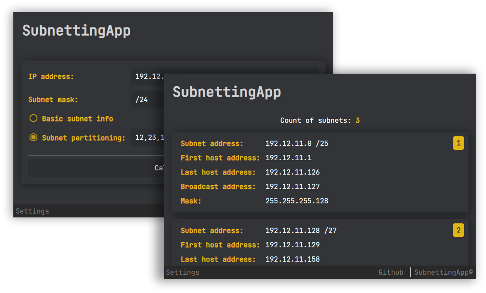

# SubnettingApp

**A simple IPv4 subnetting application made with Kotlin and Spring Boot.**

## Features

* Subnet info, partitioning
* Modern UI, light & dark theme
* Multiple languages
* ... and more

## Modules
The gradle project has been split into three separate modules:
* `subnettingapp-core` - includes the core processing tools required for subnetting calculations
* `subnettingapp-cli` - a very simple CLI made for the app
* `subnettingapp-web` - includes the actual web application